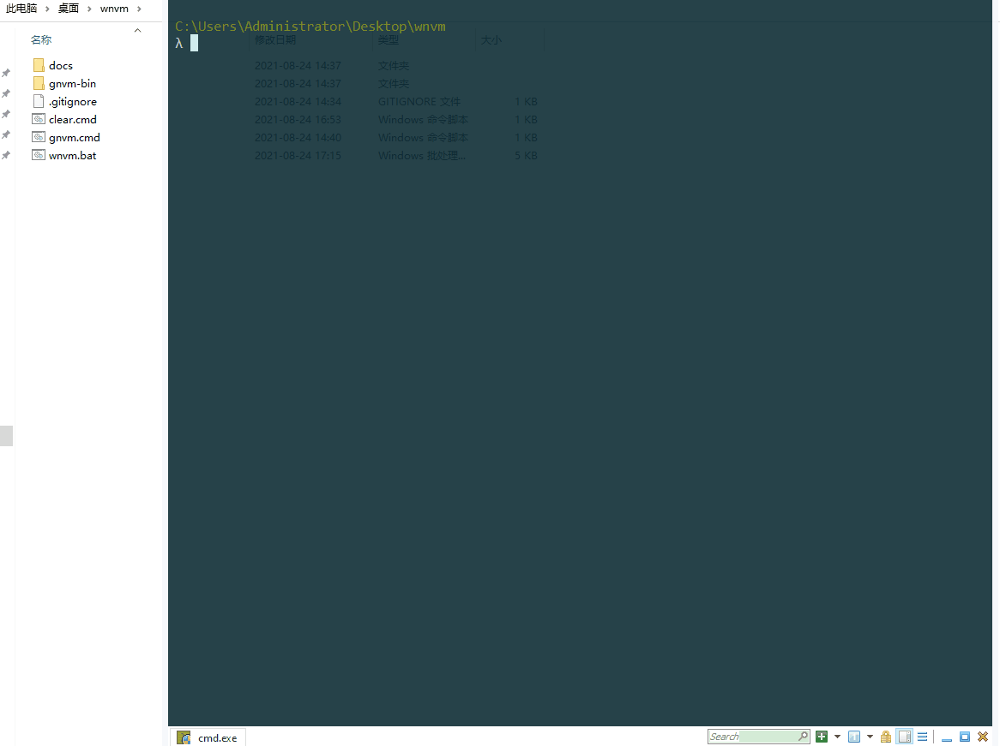

wnvm
================================  
什么是`wnvm`
---

#### `wnvm`是在 `Windows` 下通过`gnvm`进行 Node.js 多版本的切换与管理
> 上官方链接
> http://ksria.com/gnvm
> https://github.com/Kenshin/gnvm
> https://github.com/Kenshin/gnvm-bin

> #####  通过对gnvm的学习，凭借在windows上“强大”的bat能力，对gnvm进行了改装
> 

特色
---
###  `gnvm.cmd `
* gnvm.cmd支持32bit和64bit自动识别，支持所有gnvm已有功能
### ` wnvm.cmd `
----
* 只需手动配置一次环境变量，不重装电脑都不用再配置。
* 自动配置npm下载路径为本工具所在目录
* 自动配置yarn下载路径为本工具所在目录
* 自动配置配置npm加速
* 自动配置配置常用的模块国内镜像

许可
---
MIT
